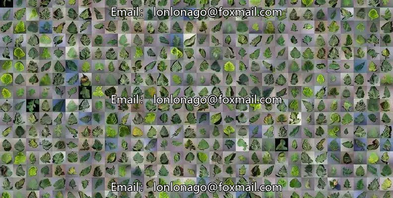
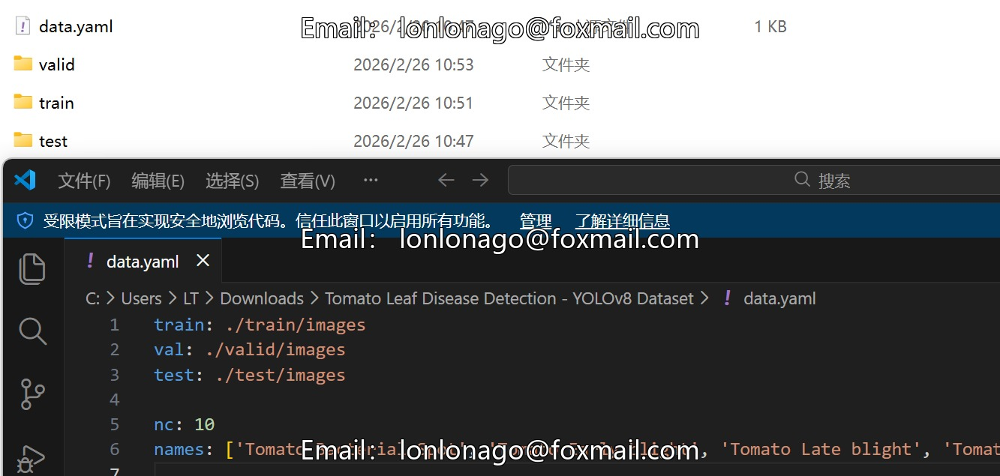
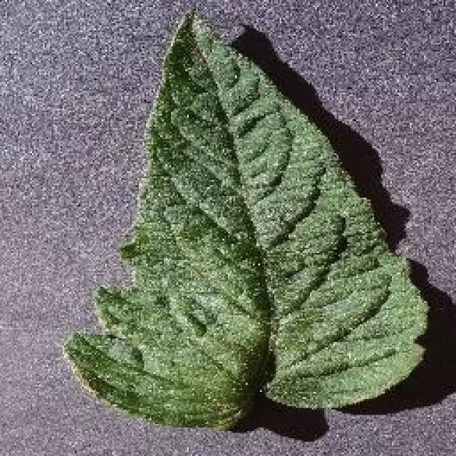
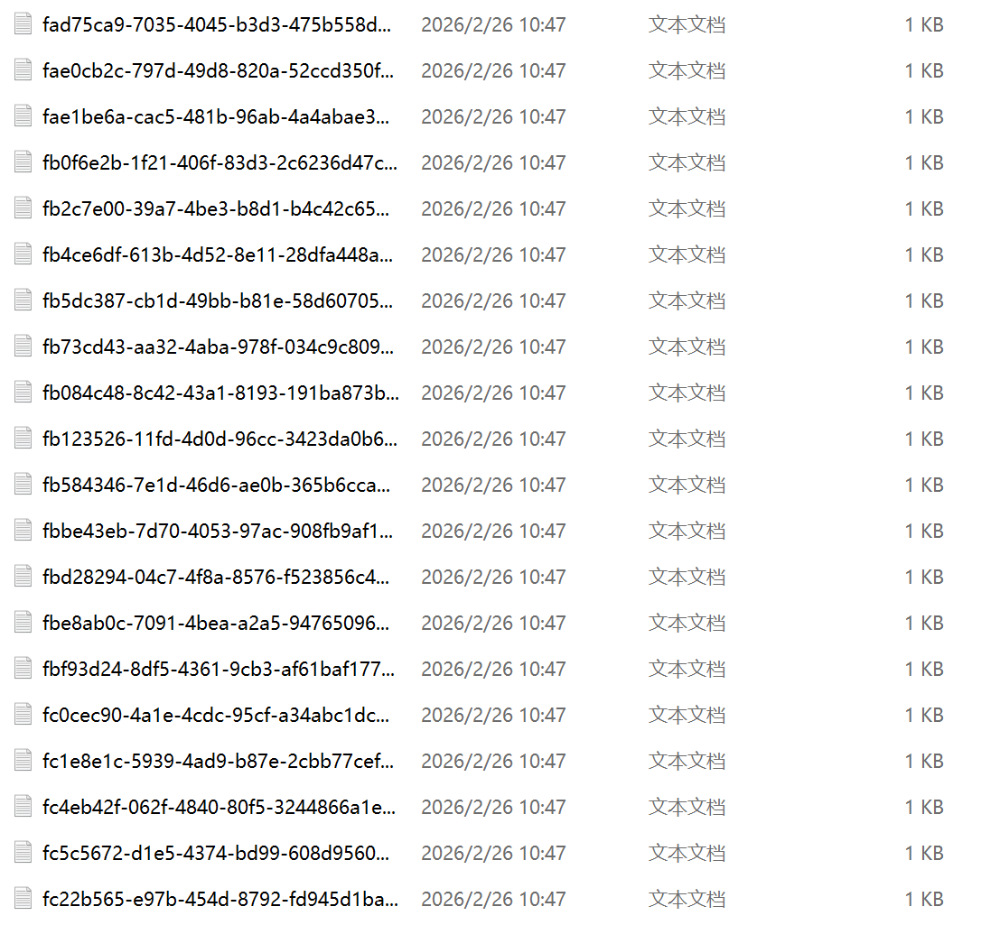

## Body

（Agricultural Product）Tomato Leaf Disease Detection - YOLOv8 Dataset

Total Images: 10,853
Train Set: 7,842 images (72%)
Validation Set: 1,960 images (18%)
Test Set: 1,051 images (10%)
Image Resolution: Resized to 640x640 (stretched)
Annotation Format: YOLOv8

A total of 10k images are available, each labeled accordingly.
The dataset is divided into ten categories, including 'Tomato Bacterial Spot', 'Tomato Early blight', 'Tomato Late blight', 'Tomato Leaf Mold', 'Tomato Septoria leaf spot', 'Tomato Spider mites Two-spotted spider mite', 'Tomato Target Spot', 'Tomato Yellow Leaf Curl Virus', 'Healthy Tomato', 'Tomato mosaic virus'

"Tomato Bacterial Spot", "Tomato Early blight", "Tomato Late blight", "Tomato Leaf Mold", "Tomato Septoria leaf spot", "Tomato Spider mites Two-spotted spider mite", "Tomato Target Spot", "Tomato Yellow Leaf Curl Virus", "Healthy Tomato", "Tomato mosaic virus"

Electronic virtual products sold without return or exchange.

## Images

Here is a pay link on Stripe ( https://buy.stripe.com/3cs8yP7sY87d0vu9AB ). Please contact me lonlonago@foxmail.com after funding $89, and I will send you a complete data files , thank you!

